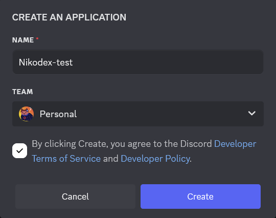

# nikodex2-bot
Discord bot that integrates with the submit functionality on Nikodex v2

## Dependecies
To setup the bot, you'll need:
- NodeJS
- An already created application on Discord (see right below for info on how to create one)

## Setup a new application for Nikodex's bot on Discord
0. Ensure you have a Discord account (duh).
1. Head on to https://discord.com/developers/applications. Click on `New Application` on the top-right corner. Enter the name of the app you want, agreeing with the Developer ToS and Developer Policy, then click on `Create` (you may need to confirm you're not a robot).

2. In the application page, head on to the `OAuth2` tab. In here, you'll see `Client information`. By default, `CLIENT SECRET` will be "Hidden for security", so you'll need to `Reset Secret`. Once reset, a new client secret will appear. Copy both `CLIEND ID` and `CLIEND SECRET` and use it in the .env file for the frontend.

3. In the `OAuth2` tab, you'll see `Redirects`. **For developing**, enter in the Local address shown when you start the front-end, with `/api/discord_auth` at the end. **For production**, enter in the domain you use for the root of the website, with `/api/discord_auth` at the end.

4. Head on to the `Bot` tab. In here, you'll need to get the `Token` for the bot. To do so, click on `Reset Token`, and after authenticating with Discord, copy the token. You will need it later.


## Setup environment file
Now create a `.env` file at the root of the directory, and fill in data below:
```
DISCORD_TOKEN="<token>" # pass in the token you got at step 4 above
CLIENT_ID="<client_id>" # pass in the client ID you got at step 2 above
API_URI="<api_uri>" # the backend API's URI. in many cases, you shouldn't have to expose the back-end API server, so you can use "http://localhost:8000" or whichever address fastapi give you or you bind using gunicorn
SUBMISSIONS_CHANNEL="<discord channel id>"
PORT=3000 # or some other port
ADMIN_ID_LIST="<a discord user id>;<another discord user id>" # discord user IDs, seperated by ';'
API_BOT_SHARED_SECRET="<shared_secret>" # a shared secret between the bot and the backend API for bot-specific API routes. it is recommended that you use a long, random value for this. this value MUST MATCH with the one on nikodex2-backend
```

## Run the bot
Install dependecies for the bot using:
```
npm i
```
Then you can run the bot by:
```
node index.js
```